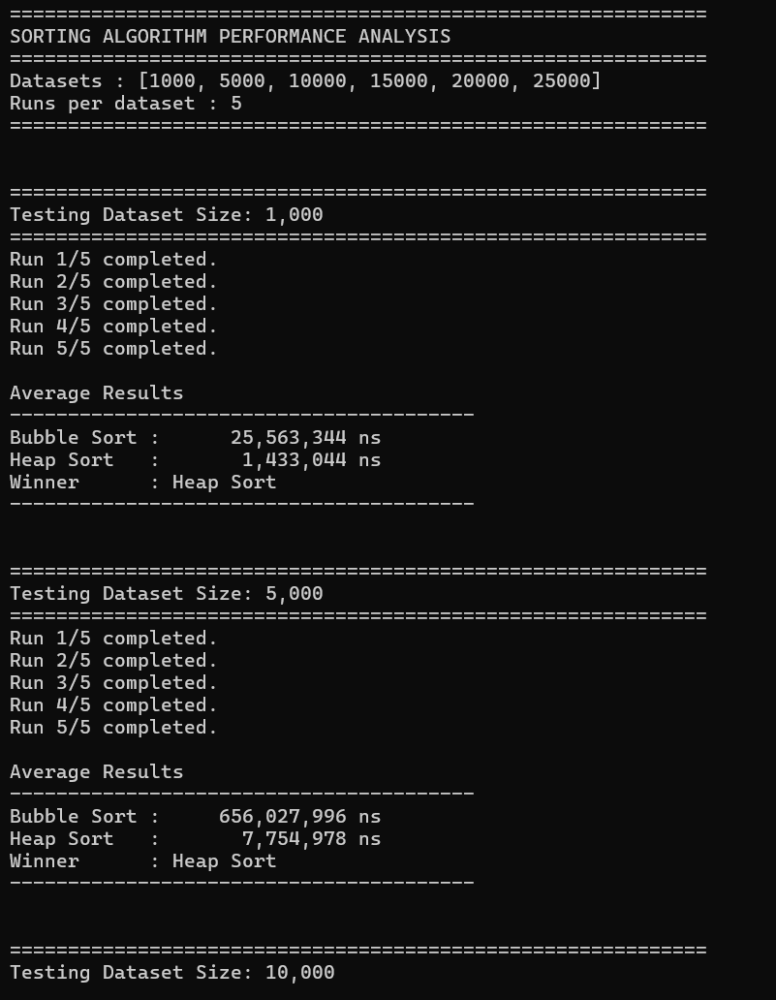
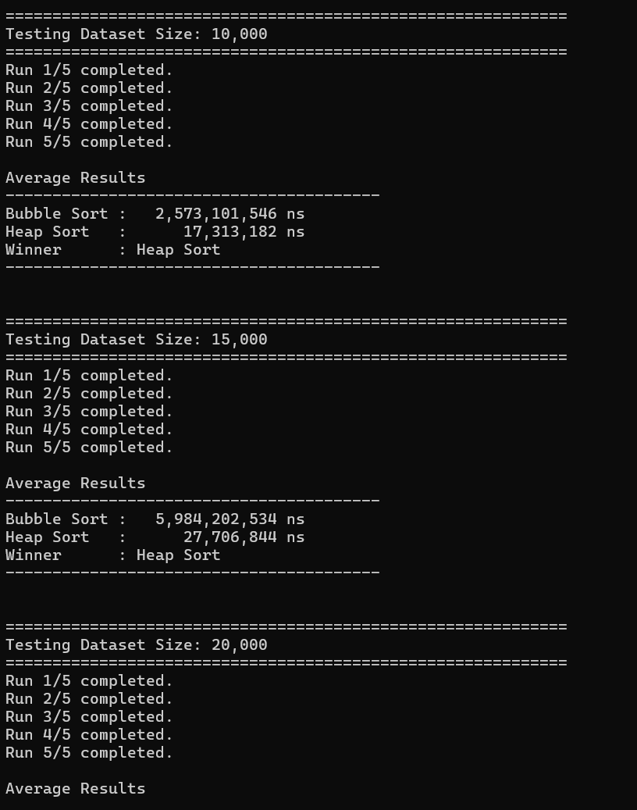
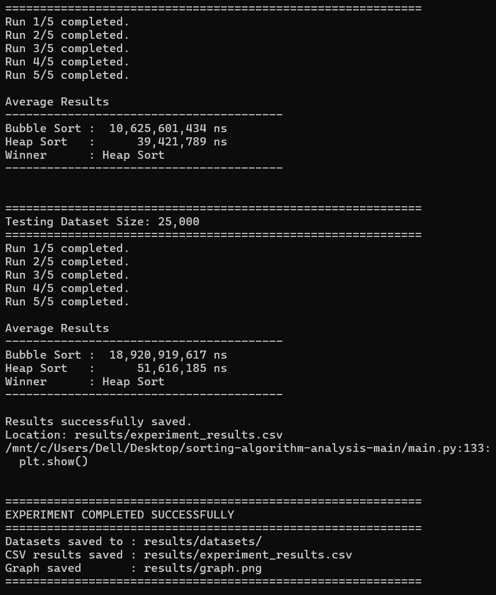
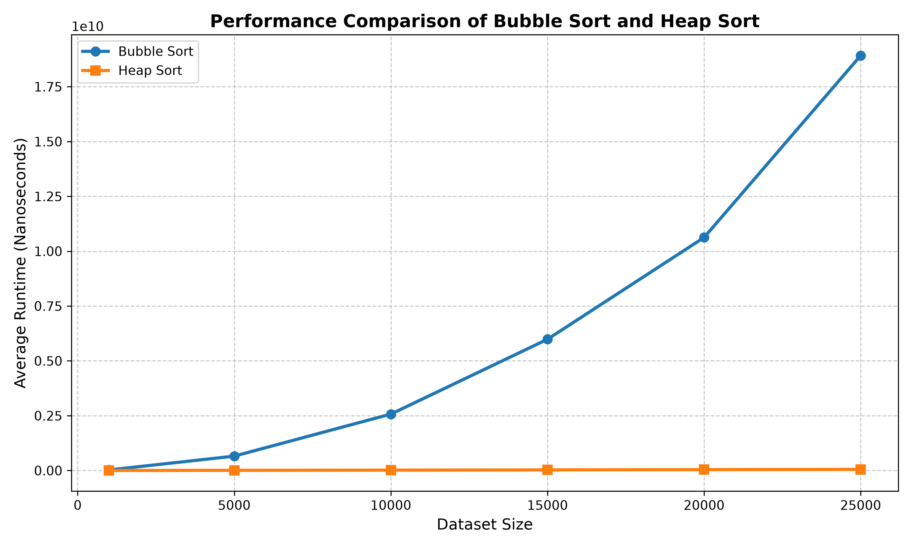

# Experimenting and Analysing Sorting Algorithms

### Data Structures and Algorithms

**Module Code:** 55-709698

**Student:** Justice Akason

**Submission:** Task C

---

# Table of Contents

- [Introduction](#introduction)
- [Question 1 – Desk Research](#question-1--desk-research)
- [Question 2 – Experimental Design](#question-2--experimental-design)
- [Unit Testing](#unit-testing)
- [Experimental Results](#experimental-results)
- [Program Execution](#program-execution)
- [Performance Graph](#performance-graph)
- [Discussion](#discussion)
- [Conclusion](#conclusion)
- [References](#references)

---

> [!NOTE]
> **Project Summary**
>
> - **Language:** Python
> - **Algorithms Compared:** Bubble Sort & Heap Sort
> - **Datasets:** 1,000–25,000 randomly generated integers
> - **Runs per Dataset:** 5
> - **Timing Method:** `time.perf_counter_ns()`
> - **Output:** CSV results and performance graph

---

# Introduction

Sorting algorithms are fundamental to computer science because they organise data into a specific order, improving the efficiency of searching and other data processing operations. This investigation compares two well-known sorting algorithms, Bubble Sort and Heap Sort, through theoretical research and empirical experimentation. The objective is to determine which algorithm performs more efficiently when sorting increasingly large randomly generated datasets.

---

# Question 1 - Desk Research

Bubble Sort is a comparison-based sorting algorithm that repeatedly compares adjacent elements and swaps them whenever they are in the wrong order. The algorithm continues making passes through the dataset until no further swaps are required. Although Bubble Sort is straightforward to understand and implement, it performs many unnecessary comparisons when datasets become larger. Its average and worst-case time complexity is **O(n²)**, making it unsuitable for large-scale applications. Heap Sort approaches the problem differently by first organising the dataset into a Binary Heap. The largest element is repeatedly removed and placed into its final sorted position while maintaining the heap property throughout the process. Heap Sort performs considerably fewer operations than Bubble Sort and maintains a time complexity of **O(n log n)** for its best, average and worst cases.

From this theoretical research, Heap Sort is expected to outperform Bubble Sort as dataset size increases.

---

# Question 2 - Experimental Design

The experiment was implemented entirely in Python using a modular software design. Separate modules were developed for Bubble Sort, Heap Sort, dataset generation, execution timing, CSV handling and automated testing. Random integer datasets containing:

- 1,000
- 5,000
- 10,000
- 15,000
- 20,000
- 25,000

elements were generated.

Although larger datasets were originally considered, Bubble Sort required substantially longer execution times on the available hardware. Therefore, the experiment was limited to 25,000 elements while still providing sufficient evidence for comparing both algorithms. Each dataset was executed **five times** using `time.perf_counter_ns()` to measure execution time in nanoseconds. Average execution times were calculated for each algorithm. To ensure a fair comparison, identical copies of every randomly generated dataset were supplied to both sorting algorithms. Before collecting performance data, both algorithms were validated using unit tests.

---

# Unit Testing

Both sorting algorithms successfully passed the unit tests, confirming that they correctly sorted the datasets before execution times were recorded.

---

# Experimental Results

The experiment produced the following average execution times.

| Dataset Size | Bubble Sort (ns) | Heap Sort (ns) | Faster Algorithm |
|--------------|-----------------:|---------------:|------------------|
| 1,000 | 25,563,344 | 1,433,044 | Heap Sort |
| 5,000 | 656,027,996 | 7,754,978 | Heap Sort |
| 10,000 | 2,573,101,546 | 17,313,182 | Heap Sort |
| 15,000 | 5,984,202,534 | 27,706,844 | Heap Sort |
| 20,000 | 10,625,601,434 | 39,421,789 | Heap Sort |
| 25,000 | 18,920,919,617 | 51,616,185 | Heap Sort |

---

# Program Execution

  

  

The screenshots above demonstrate the execution of the experiment. Each dataset was processed five times before calculating the average runtime. Bubble Sort and Heap Sort were executed using identical datasets to ensure an unbiased comparison.

---

# Performance Graph

---

# Discussion

The empirical results strongly support the theoretical expectations discussed during the desk research. Bubble Sort's execution time increased dramatically as dataset size became larger. This behaviour reflects its **O(n²)** time complexity, where the number of comparisons grows quadratically with the size of the dataset. Heap Sort demonstrated significantly better scalability throughout every experiment and although its execution time also increased as the datasets became larger, the increase was relatively small because Heap Sort has a complexity of **O(n log n)**. The largest dataset containing 25,000 elements clearly demonstrates this difference. Bubble Sort required approximately **18.9 billion nanoseconds**, whereas Heap Sort completed the same task in approximately **51.6 million nanoseconds**. This represents a substantial performance improvement and highlights why Heap Sort is preferred for larger datasets.

---

# Conclusion

This investigation successfully compared Bubble Sort and Heap Sort using both theoretical research and empirical experimentation. The experimental results consistently showed that Heap Sort outperformed Bubble Sort for every dataset tested. Bubble Sort remains useful for educational purposes because of its simple implementation, but its quadratic complexity makes it unsuitable for large datasets. Heap Sort provides significantly better scalability and is therefore a more practical choice for real-world software systems that process large amounts of data. Overall, the experiment demonstrated the importance of selecting appropriate algorithms and data structures when developing efficient software applications.

---

# References

1. Cormen, T. H., Leiserson, C. E., Rivest, R. L., & Stein, C. *Introduction to Algorithms*. MIT Press.

2. Goodrich, M. T., Tamassia, R., & Goldwasser, M. H. *Data Structures and Algorithms in Python*. Wiley.

3. Python Software Foundation. https://docs.python.org/3/

---

### ✅ Project Completed Successfully

**Repository Contents**

✔ Bubble Sort implementation

✔ Heap Sort implementation

✔ Unit testing

✔ Dataset generation

✔ CSV export

✔ Performance analysis

✔ Graph generation

✔ Experimental report

